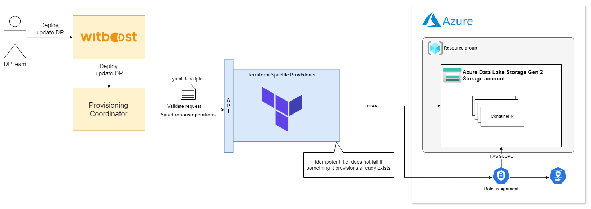
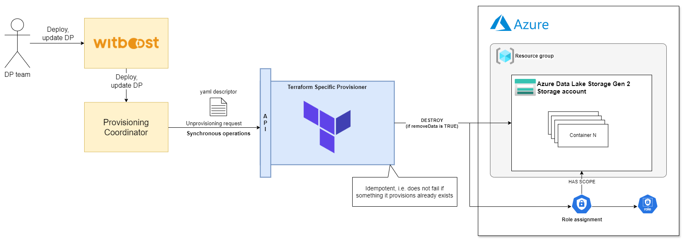

# High Level Design

This document describes the High Level Design of a module that handles Azure ADLS Gen2 Storage using the Terraform Specific Provisioner.
The source diagrams can be found and edited in the [accompanying draw.io file](hld.drawio).

## Overview

### Specific Provisioner

A Specific Provisioner (SP) is a service in charge of performing a resource allocation task, usually
through a Cloud Provider. The resources to allocate are typically referred to as the _Component_, the
details of which are described in a YAML file, known as _Component Descriptor_.

The SP is invoked by an upstream service of the Witboost platform, namely the Coordinator, which is in charge of orchestrating the creation
of a complex infrastructure by coordinating several SPs in a single workflow. The SP receives the _Data Product Descriptor_ as input with all the components (because it might need more context) plus the id of the component to provision, named _componentIdToProvision_

To enable the above orchestration a SP exposes an API made up of five main operations:
- validate: checks if the provided component descriptor is valid and reports any errors
- provision: allocates resources based on the previously validated descriptor; clients either receive an immediate response (synchronous) or a token to monitor the provisioning process (asynchronous)
- status: for asynchronous provisioning, provides the current status of a provisioning request using the provided token
- unprovision: destroys the resources previously allocated.
- updateacl: **not supported**

### Azure ADLS Gen 2

Azure Data Lake Storage Gen2 is a set of capabilities dedicated to big data analytics, built on Azure Blob Storage.

A data lake is a single, centralized repository where you can store all your data, both structured and unstructured. A data lake enables your organization to quickly and more easily store, access, and analyze a wide variety of data in a single location. With a data lake, you don't need to conform your data to fit an existing structure. Instead, you can store your data in its raw or native format, usually as files or as binary large objects (blobs).

### Azure ADLS Gen 2 Specific Provisioner

Azure ADLS Gen 2 Specific Provisioner is used to provision an Azure ADLS Gen 2 data lake.
The workload template provides all the information that are needed to create that resource.

This Specific Provisioner interacts with the Azure environment by creating an `ADLS Gen 2 storage account` and, depending on the configuration, one or multiple `containers`. It is assumed that the Resource Group already exists.

The Storage Account name must be composed in a way to not interfere with other Data Products and/or other components of the same type in the same Data Product.
In addition, the following rules need be respected:
- Storage account names must be between **3 and 24 characters** in length and may contain **numbers** and **lowercase letters** only.
- Your storage account name must be **unique within Azure**. No two storage accounts can have the same name.

Appropriate permissions are granted to the `Data Product Owner` and `Dev Group`. Those permissions are **scoped** to the provisioned Storage Account.

The project contains **Terraform configuration files** to be used along with the [Terraform Specific Provisioner](https://github.com/agile-lab-dev/witboost-terraform-scaffold).

## Validation

In this phase a `terraform plan` is executed against the resources to be created:

Refer to the Terraform Specific Provisioner [HLD](https://github.com/agile-lab-dev/witboost-terraform-scaffold/blob/master/docs/HLD.md#validation) to read more details about validation.

## Provisioning

In this phase a `terraform apply` is executed to create the resources:

Refer to the Terraform Specific Provisioner [HLD](https://github.com/agile-lab-dev/witboost-terraform-scaffold/blob/master/docs/HLD.md#provision-and-unprovision) to read more details about provisioning.

## Unprovisioning

In this phase a `terraform destroy` is executed to remove the resources if the `removeData` flag sent by the Provisioning Coordinator in the request is `true`:

Refer to the Terraform Specific Provisioner [HLD](https://github.com/agile-lab-dev/witboost-terraform-scaffold/blob/master/docs/HLD.md#provision-and-unprovision) to read more details about unprovisioning.

## Update Acl

The operation is not supported at the moment.

# References

1. [Access control lists (ACLs) in Azure Data Lake Storage Gen2](https://learn.microsoft.com/en-us/azure/storage/blobs/data-lake-storage-access-control)
